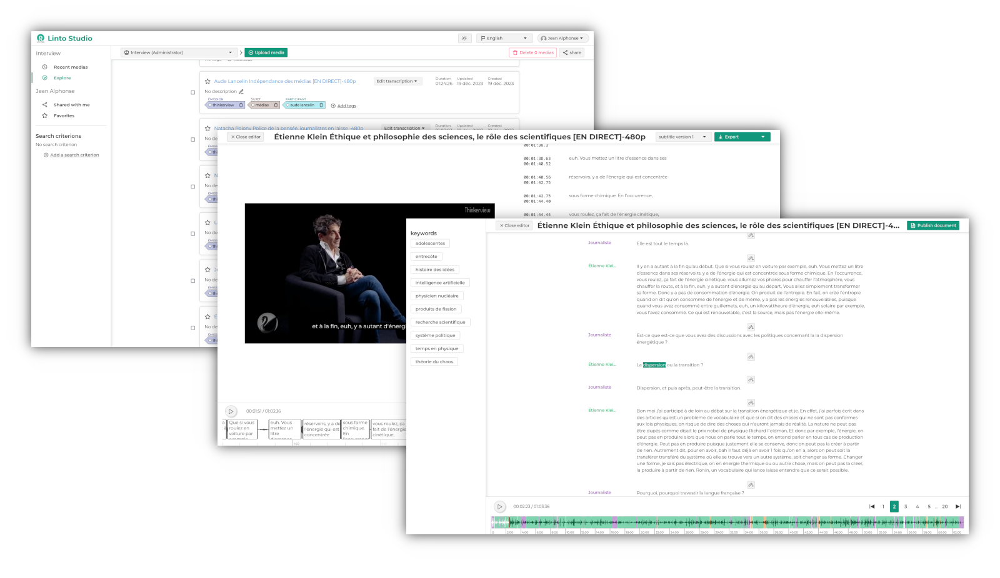
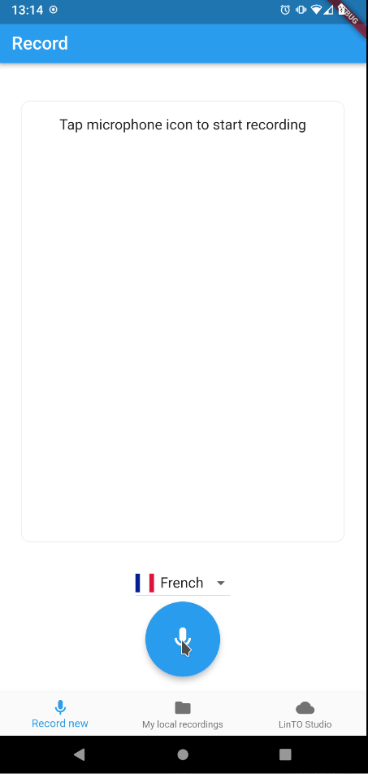

<h1 align="center">LinTO Studio</h1>

<h4 align="center">Open Source AI driven recording, transcription and media management solution
<br/>
<a href="https://studio.linto.app" target="_blank" rel="noopener noreferrer">Demo</a> •
<a href="https://linto.app" target="_blank" rel="noopener noreferrer">Get the android application  </a>
</h4>




## Features

- Media management platform
- Advanced transcription features (speaker identification, ...)
- Auto timestamp alignement
- NLP and AI features
- Closed caption edition

## With a companion app

<div align="center">

</div>

- Record on the go
- Synchronize your media with LinTO studio

## Installation and Usage

Since LinTO Studio relies on a complex set of LinTO services, such as transcription services, we **highly recommend** using our deployment tool:

[https://github.com/linto-ai/linto](https://github.com/linto-ai/linto)

Alternatively, you can use Docker Compose to run the app directly (web interface and API), but note that it won't be fully functional.

```
docker-compose up -d
```

then open your web browser to http://localhost:8003

## Configuration

### SMTP configuration

You can configure an smtp server, for improving sharing and account verification.

```
SMTP_HOST=mail.example.com
SMTP_PORT=465
SMTP_SECURE=true
SMTP_REQUIRE_TLS=true
SMTP_AUTH=username
SMTP_PSWD=password
NO_REPLY_EMAIL=noreply@mail.example.com
```

### Transcription Service

By default, LinTO Studio uses the LinTO API Gateway for transcription. If you want to use Studio with a different gateway, set the environment variable as follows:


For more information, visit: [https://github.com/linto-ai/linto](https://github.com/linto-ai/linto)


