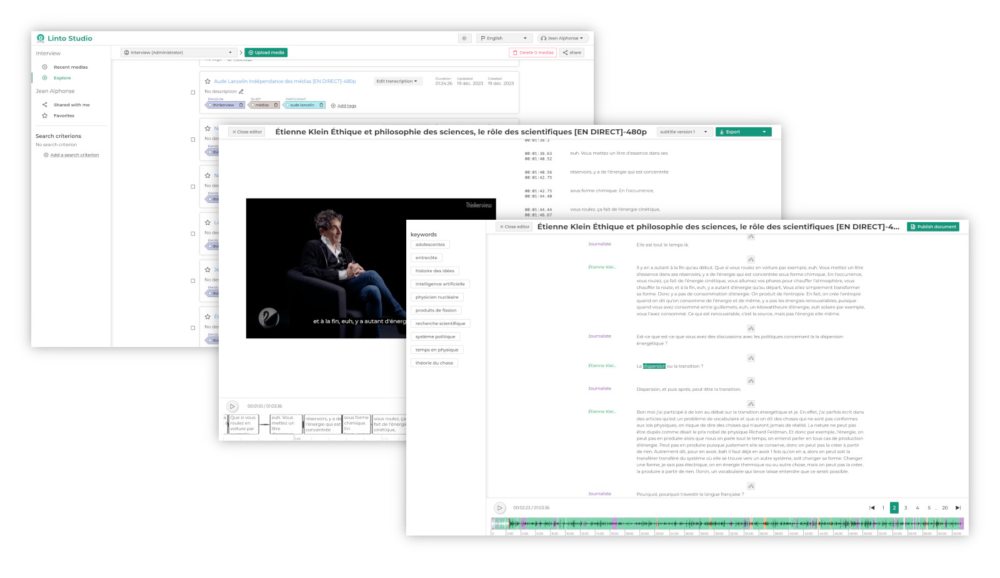

<h1 align="center">LinTO Studio</h1>

<h4 align="center">Open Source AI driven recording, transcription and media management solution</h4>



## Features

- Media management platform
- Advanced transcription features (speaker identification, ...)
- Auto timestamp alignement
- NLP and AI features
- Closed caption edition

## With a companion app

<div align="center">

</div>

- Record on the go
- Synchronize your media with LinTO studio

## Install and use

```
docker-compose up -d
```

then open your web browser to http://localhost:8003

## Configuration

### SMTP configuration

You can configure an smtp server, for improving sharing and account verification.

```
SMTP_HOST=mail.example.com
SMTP_PORT=465
SMTP_SECURE=true
SMTP_REQUIRE_TLS=true
SMTP_AUTH=username
SMTP_PSWD=password
NO_REPLY_EMAIL=noreply@mail.example.com
```

### Transcription service

By default LinTO Studio uses the LinTO API Gateway to do transcription. To use Studio with another gateway, set environnement variables
```
GATEWAY_SERVICES="API Gateway service endpoint"
```

