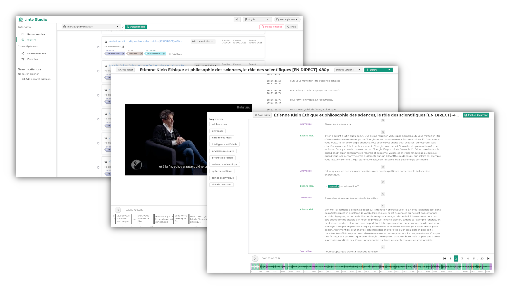

<h1 align="center">LinTO Studio</h1>

<h4 align="center">Open source transcription, live subtitling and meeting summarization
<br/>
<a href="https://studio.linto.ai" target="_blank" rel="noopener noreferrer">Hosted version</a> •
<a href="https://linto.ai" target="_blank" rel="noopener noreferrer">linto.ai</a> •
<a href="https://github.com/linto-ai" target="_blank" rel="noopener noreferrer">All LinTO repositories</a>
</h4>



LinTO Studio is the web application of the LinTO platform. Upload or record media, get a transcript with speaker separation and word-level timestamps, edit it with your team, generate minutes and summaries, and export to your own document templates. It also runs live sessions: subtitles and translation for meetings and events, from a microphone, a meeting bot or a broadcast stream.

## Features

- Transcription of audio and video files with speaker separation and word-level timestamps
- Speaker identification across recordings from voice signatures, managed per organization
- Collaborative transcript editor with real-time sync, undo, and audio following
- Summaries, minutes and chat over the transcript, with the LLM of your choice through [llm-gateway](https://github.com/linto-ai/llm-gateway)
- Exports in several formats and your own DOCX templates
- Subtitle editing and export for videos
- Live sessions: microphone recording from the browser, meeting bots (Teams, Jitsi, BigBlueButton, Visio), SRT/RTMP streams through [linto-studio-plugins](https://github.com/linto-ai/linto-studio-plugins)
- Organizations, roles, sharing, tags and search
- REST API with [JavaScript and Python SDKs](studio-sdk/), OAuth and OIDC login

## Repository layout

| Directory | What it is |
|---|---|
| `studio-api/` | REST API (Express, MongoDB), authentication, organizations, media, transcription jobs |
| `studio-frontend/` | Web application (Vue) |
| `studio-websocket/` | Real-time collaboration server (Socket.io, Yjs) |
| `studio-sdk/` | JavaScript and Python client libraries, and the transcript editor as a standalone component |
| `doc/` | Screenshots and API documentation |

Development happens on `next`. `master` holds releases. Release notes are in [RELEASE.md](RELEASE.md).

## Installation

LinTO Studio depends on other LinTO services (speech-to-text, speaker separation, LLM gateway, live plugins). To install the whole stack on a Kubernetes cluster, use the deployment tool:

[https://github.com/linto-ai/linto-deploy](https://github.com/linto-ai/linto-deploy)

To run only the web application and its API locally, for development:

```bash
docker compose up -d
```

Then open http://localhost:8003. The API listens on port 8001 and the websocket server on 8002. Transcription, summarization and live features need the corresponding services to be configured (see below).

Each package also has its own README for native development with `npm run dev`.

## Configuration

Configuration is done through environment variables. Copy `studio-api/.envdefault` to `studio-api/.env` and adjust it. The main settings:

### SMTP

Used for account verification, invitations and sharing.

```
SMTP_HOST=mail.example.com
SMTP_PORT=465
SMTP_SECURE=true
SMTP_REQUIRE_TLS=true
SMTP_AUTH=username
SMTP_PSWD=password
NO_REPLY_EMAIL=noreply@mail.example.com
```

### Transcription services

Studio talks to the LinTO API gateway, which exposes the transcription, speaker separation and speaker identification services:

```
GATEWAY_SERVICES=https://<your-gateway-domain>
```

### LLM gateway

Summaries, minutes and chat go through [llm-gateway](https://github.com/linto-ai/llm-gateway):

```
LLM_GATEWAY_SERVICES=https://<your-llm-gateway-domain>
```

See `studio-api/.envdefault` for the full list, including authentication providers, live sessions and speaker identification.

## Contributing

Read [CONTRIBUTING.md](CONTRIBUTING.md) before opening a pull request, and [SECURITY.md](SECURITY.md) to report a vulnerability.

## License

[AGPL-3.0](LICENSE)
