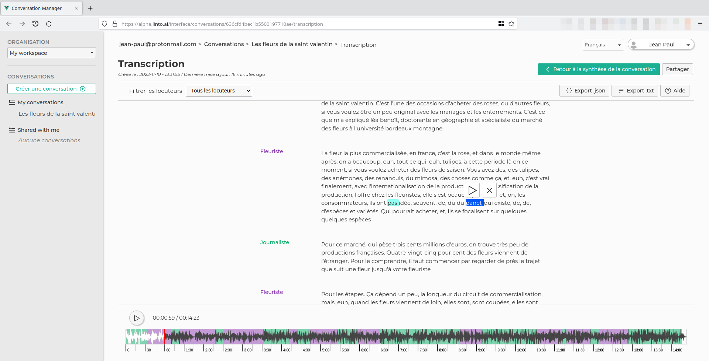

# Conversation manager — Front-End

Transcription / summarization / annotation interface for recorded audio files with sharing and live collaborative edition.



**Try it** on https://convos.linto.ai

## Installation

### 1/ Deploy the backend and the websocket service

- https://github.com/linto-ai/platform-conversation-manager
- https://github.com/linto-ai/platform-conversation-manager-websocket

### 2/ Clone project and install dependencies

```bash
  cd your/project/path
  git clone git@github.com:linto-ai/platform-conversation-manager-front.git
  cd platform-conversation-manager-front
  npm install
```

### 3/ Setup environnement variables

Copy _.envTemplate_ file as _.env_

```bash
  copy .envTemplate .env
```

- VUE_APP_HOST: The host of your application
- VUE_APP_PUBLIC_MEDIA: Linto Studio API media public path
- VUE_APP_CONVO_API: Linto Studio api url
- VUE_APP_CONVO_AUTH: Linto Studio auth service url
- VUE_APP_DEBUG: Enable or disable debug. "\*" for all debug, "vue" for only front debug, "worker" for worker debug. False otherwise.
- VUE_APP_WEBSOCKET_SERVER: url of the websocket (see https://github.com/linto-ai/platform-conversation-manager-websocket.git)
- VUE_APP_WEBSOCKET_PATH: path of the websocket (if empty, will be /socket.io)
- VUE_APP_MULTIFILE: activate support for multifile conversation (not well supported)
- VUE_APP_TURN_SIZE: number max of characters by turn
- VUE_APP_TURN_PER_PAGE: number max of turn per page

### Run

To serve and render the interface:

#### Development mode

```bash
  npm run serve-dev
```

#### Build for production

To build static files (production mode), run

```bash
  npm run build
```
